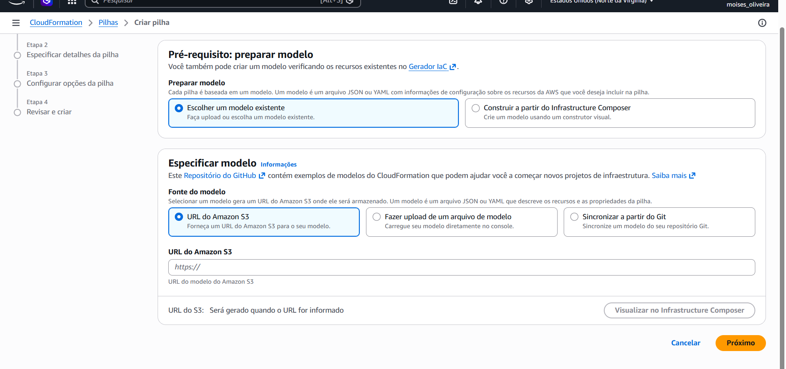
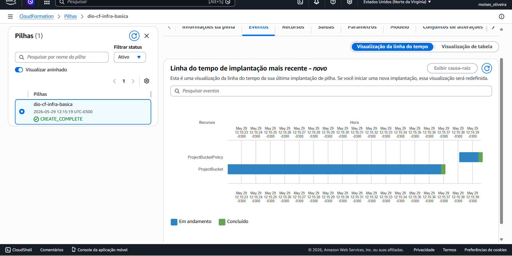
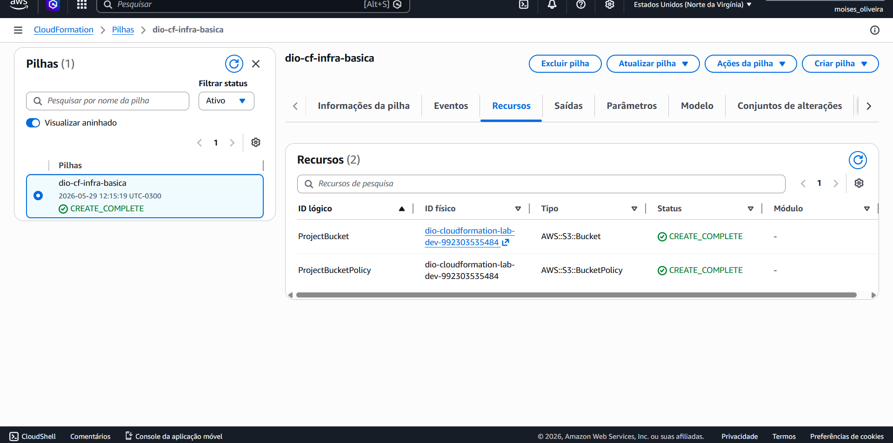
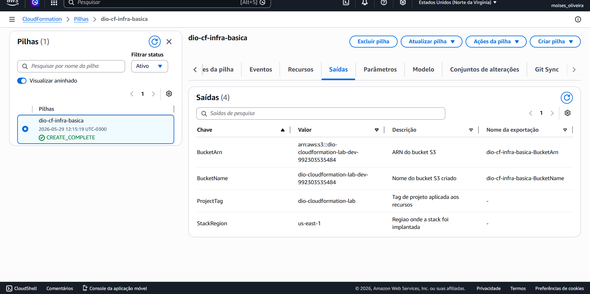
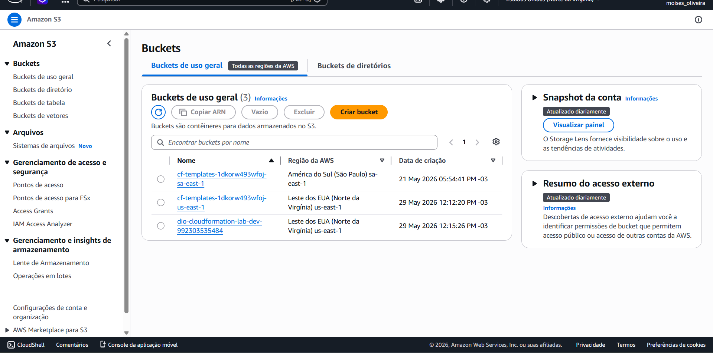

# Implementando Infraestrutura Automatizada com AWS CloudFormation

Projeto desenvolvido como entrega do laboratório **AWS CloudFormation - Automação de Infraestrutura como Código** da [Digital Innovation One (DIO)](https://web.dio.me/).

## Sobre o projeto

Este repositório documenta a prática de **Infraestrutura como Código (IaC)** utilizando o **AWS CloudFormation**, serviço nativo da AWS para provisionar, atualizar e gerenciar recursos de forma declarativa por meio de templates JSON ou YAML.

O objetivo é demonstrar:

- Criação e organização de templates CloudFormation
- Implantação de stacks no console AWS
- Uso de parâmetros, recursos, outputs e metadados
- Comparação prática com outras ferramentas de IaC (Terraform)
- Documentação técnica estruturada no GitHub

## Estrutura do repositório

```
.
├── README.md
├── docs/
│   └── insights.md              # Anotações e aprendizados do laboratório
├── images/                      # Capturas de tela da prática na AWS
│   ├── GUIA-PRINTS.md           # Passo a passo para obter os prints
│   ├── 03-create-stack-template.png
│   ├── 04-stack-options.png
│   ├── 05-stack-events-timeline.png
│   ├── 05-stack-events.png
│   ├── 06-stack-resources.png
│   ├── 07-stack-outputs.png
│   └── 08-s3-bucket.png
└── templates/
    ├── infra-basica.yaml        # Stack gratuita (S3) — recomendada para demo
    └── lamp-single-instance.yaml # Stack LAMP (EC2) — alinhada às aulas
```

## Templates disponíveis

### 1. `infra-basica.yaml` (recomendado para entrega)

Stack **sem custo significativo**, ideal para demonstrar CloudFormation com segurança:

| Recurso | Descrição |
|---------|-----------|
| `AWS::S3::Bucket` | Bucket com versionamento e criptografia |
| `AWS::S3::BucketPolicy` | Política que nega tráfego HTTP inseguro |
| Tags | Project, Environment, ManagedBy, Course |
| Outputs | Nome, ARN, região e tags exportados |

**Parâmetros:** `ProjectName`, `Environment`

### 2. `lamp-single-instance.yaml` (referência das aulas)

Template inspirado no **LAMP Single Instance** visto no **Infrastructure Composer** durante as aulas da DIO. Provisiona:

| Recurso | Descrição |
|---------|-----------|
| `AWS::EC2::Instance` | Servidor web com Apache, PHP e MySQL |
| `AWS::EC2::SecurityGroup` | Regras HTTP (80) e SSH (22) |
| UserData | Script de bootstrap automático |
| Outputs | URL do site, DNS público, Instance ID |

**Parâmetros:** `KeyName`, `InstanceType`, `SSHLocation`, `DBName`, `DBUsername`, `DBRootPassword`

> **Atenção:** Este template cria uma instância EC2 e pode gerar custos. Use `t2.micro` apenas se estiver dentro do Free Tier e **delete a stack ao finalizar** o laboratório.

## Pré-requisitos

- Conta AWS ativa
- Acesso ao [AWS Management Console](https://console.aws.amazon.com/)
- Região configurada (ex.: **América do Sul — São Paulo / sa-east-1**)
- (Opcional, para LAMP) Par de chaves EC2 criado na região

## Como implantar a stack (Console AWS)

### Opção A — Stack básica (S3)

1. Acesse **CloudFormation** no console AWS
2. Clique em **Create stack** → **With new resources**
3. Em **Specify template**, escolha **Upload a template file**
4. Faça upload de `templates/infra-basica.yaml`
5. Informe um nome para a stack, ex.: `dio-cf-infra-basica`
6. Revise os parâmetros (`ProjectName`, `Environment`)
7. Marque as opções de reconhecimento e clique em **Create stack**
8. Aguarde o status **CREATE_COMPLETE**
9. Acesse a aba **Outputs** para ver os valores exportados

### Opção B — Stack LAMP (EC2)

1. Crie um **Key Pair** em EC2 → Key Pairs (se ainda não tiver)
2. Siga os passos acima, usando `templates/lamp-single-instance.yaml`
3. Preencha os parâmetros obrigatórios (`KeyName`, `DBRootPassword`, etc.)
4. Após **CREATE_COMPLETE**, copie a `WebsiteURL` dos Outputs
5. Abra a URL no navegador para validar a página LAMP

### Opção C — AWS CLI (alternativa)

```bash
aws cloudformation create-stack \
  --stack-name dio-cf-infra-basica \
  --template-body file://templates/infra-basica.yaml \
  --parameters ParameterKey=ProjectName,ParameterValue=dio-cloudformation-lab \
               ParameterKey=Environment,ParameterValue=dev \
  --region sa-east-1
```

```bash
aws cloudformation describe-stacks \
  --stack-name dio-cf-infra-basica \
  --region sa-east-1 \
  --query "Stacks[0].StackStatus"
```

## Como excluir a stack (importante)

Para evitar cobranças após o laboratório:

1. CloudFormation → selecione a stack
2. **Delete**
3. Confirme a exclusão
4. Aguarde **DELETE_COMPLETE**

Buckets S3 versionados podem exigir esvaziamento manual antes da exclusão.

## CloudFormation vs Terraform

| Aspecto | AWS CloudFormation | Terraform |
|---------|-------------------|-----------|
| Provedor | Específico da AWS | Multi-cloud (AWS, Azure, GCP, etc.) |
| Integração | Nativa no console AWS | Requer CLI e providers |
| Estado | Gerenciado pela AWS (stacks) | Arquivo de state local/remoto |
| Linguagem | JSON / YAML | HCL (HashiCorp Configuration Language) |
| Ideal para | Ambientes 100% AWS | Ambientes multi-cloud ou híbridos |

## Conceitos aplicados

- **Template:** arquivo declarativo com a definição da infraestrutura
- **Stack:** conjunto de recursos criados a partir de um template
- **Parameters:** valores configuráveis na criação da stack
- **Resources:** componentes AWS a serem provisionados
- **Outputs:** informações exportadas após a implantação
- **Metadata:** organização da interface no console (ParameterGroups)
- **IaC Generator:** ferramenta AWS para gerar templates a partir de recursos existentes

## Aprendizados e insights

Consulte o arquivo [docs/insights.md](docs/insights.md) para anotações detalhadas sobre a experiência prática, benefícios do CloudFormation e boas práticas identificadas durante o laboratório.

## Evidências da prática

As capturas de tela do deploy realizado na AWS estão na pasta [`/images`](images/). Elas documentam todo o fluxo: upload do template, configuração da pilha, criação dos recursos e validação no S3.

| Arquivo | Descrição |
|---------|-----------|
| [03-create-stack-template.png](images/03-create-stack-template.png) | Upload do template `infra-basica.yaml` |
| [04-stack-options.png](images/04-stack-options.png) | Configuração de opções da pilha |
| [05-stack-events-timeline.png](images/05-stack-events-timeline.png) | Linha do tempo com status **CREATE_COMPLETE** |
| [05-stack-events.png](images/05-stack-events.png) | Aba Eventos da pilha `dio-cf-infra-basica` |
| [06-stack-resources.png](images/06-stack-resources.png) | Recursos criados (S3 Bucket + Bucket Policy) |
| [07-stack-outputs.png](images/07-stack-outputs.png) | Outputs exportados (BucketName, BucketArn, região) |
| [08-s3-bucket.png](images/08-s3-bucket.png) | Bucket criado visível no console S3 |

### Galeria











> Guia completo para reproduzir as capturas: [images/GUIA-PRINTS.md](images/GUIA-PRINTS.md)

## Referências

- [Documentação AWS CloudFormation](https://docs.aws.amazon.com/cloudformation/)
- [Infrastructure Composer](https://docs.aws.amazon.com/infrastructure-composer/latest/dg/what-is-infrastructure-composer.html)
- [AWS CloudFormation Sample Templates](https://docs.aws.amazon.com/AWSCloudFormation/latest/UserGuide/cfn-sample-templates.html)
- [GitHub Markdown Guide](https://docs.github.com/pt/get-started/writing-on-github/getting-started-with-writing-and-formatting-on-github/basic-writing-and-formatting-syntax)

## Autor

**Moisés Santos de Oliveira** — [@sir-devtech](https://github.com/sir-devtech)

Projeto entregue como parte da formação **AWS Cloud** na Digital Innovation One.
